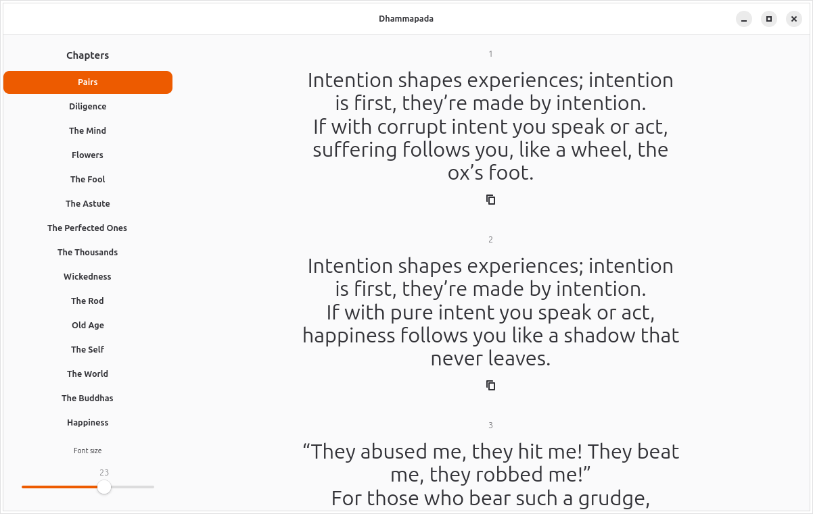

<h1>
  
  Dhammapada
</h1>

A simple Dhammapada verse viewer for the Linux desktop.



## Technical Stack
* **Language**: Rust
* **UI Toolkit**: GTK4 and Libadwaita
* **Data Handling**: Serde and TOML for configuration and data parsing
* **Localization**: gettext (supporting multiple languages via `.po` files)

## Building from source
To compile and run the project locally, ensure you have the Rust toolchain, **GTK4**, and **Libadwaita** development libraries installed:

```bash
# Example for Ubuntu/Debian:
# sudo apt install libgtk-4-dev libadwaita-1-dev

cargo run
```

## Copyright and License
This project is licensed under the **CC BY-NC-SA 4.0** license